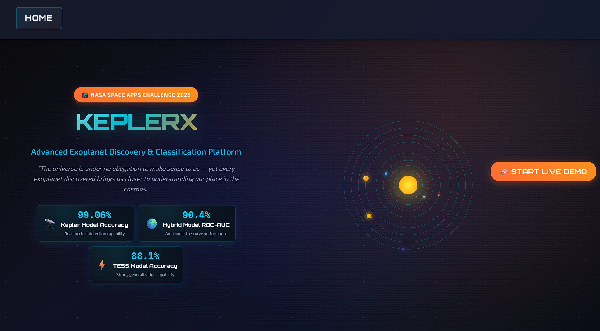
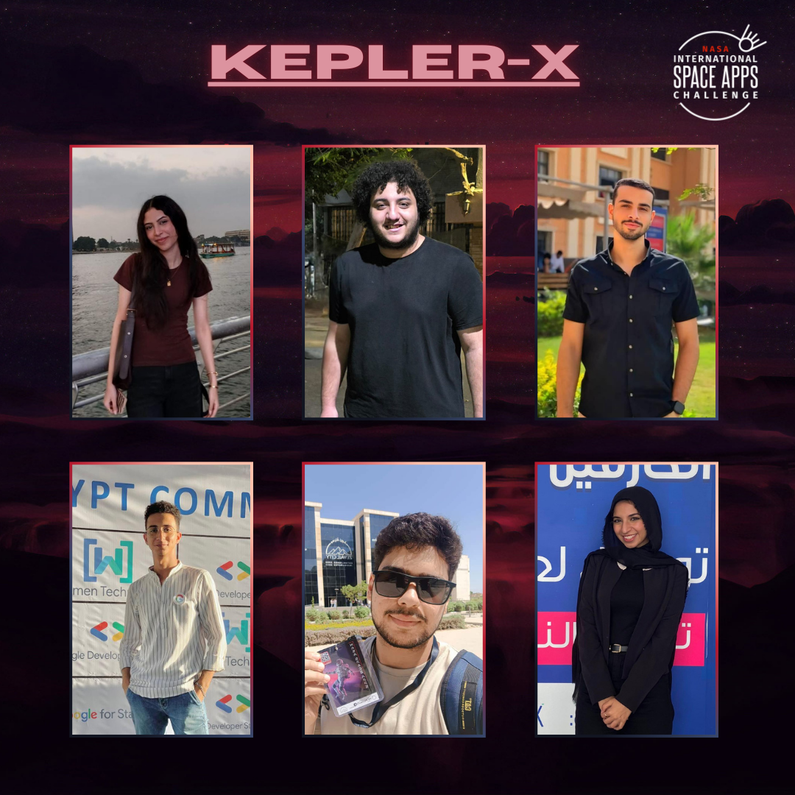

# 🌌 KeplerX: Haunting Exoplanets
### *Revolutionizing Exoplanet Discovery Through Machine Learning*

<div align="center">



</div>

[](https://opensource.org/licenses/MIT)
[](https://python.org)
[](https://github.com/topics/machine-learning)
[](https://github.com/topics/astronomy)

---

## 🚀 **Project Overview**

**KeplerX: Haunting Exoplanets** is a cutting-edge machine learning platform that transforms the way we discover and classify exoplanets. By harnessing the power of AI and NASA's vast astronomical datasets, we've automated the traditionally manual process of exoplanet validation, enabling researchers to analyze thousands of observations with unprecedented speed and accuracy.

### **🎯 Mission Statement**
*"To democratize exoplanet discovery by making advanced AI classification tools accessible to astronomers, researchers, and space enthusiasts worldwide."*

---

## 🌟 **The Challenge We Solve**

Over the past decade, space missions like **Kepler**, **K2**, and **TESS** have revolutionized our understanding of the cosmos, discovering thousands of potential exoplanets through the transit method. However, the validation process has remained largely manual, requiring astronomers to spend countless hours analyzing each candidate.

**The bottleneck:** Manual validation simply cannot keep pace with the exponential growth of astronomical data.

**Our solution:** AI-powered automation that maintains scientific rigor while dramatically accelerating discovery timelines.

---

## 🛠️ **Technology Stack**

### **🧠 Machine Learning**
- **XGBoost** - High-performance gradient boosting
- **Scikit-learn** - Comprehensive ML toolkit
- **Pandas & NumPy** - Data manipulation and analysis
- **Matplotlib & Seaborn** - Advanced visualizations

### **🌐 Web Platform**
- **FastAPI** - Modern, high-performance web framework
- **HTML5/CSS3/JavaScript** - Responsive frontend interface
- **Space-themed UI** - Professional dark theme with NASA-inspired design

### **📊 Data Sources**
- **Kepler Mission** - High-precision, long-term stellar observations
- **TESS Mission (TOI)** - Wide-sky coverage with shorter observation periods
- **NASA Exoplanet Archive** - Authoritative reference catalog

---

## 🎛️ **Platform Features**

### **1. 📈 Bulk Classification Engine**
Transform your research workflow with batch processing capabilities:
- **Upload CSV datasets** for immediate classification
- **Choose between models**: Kepler (99.06% accuracy) or TOI (88.13% accuracy)
- **Real-time progress tracking** with detailed processing metrics
- **Automated validation** against NASA's confirmed exoplanet database

### **2. 🔍 Manual Parameter Analysis**
Deep-dive into individual candidates with precision:
- Input **15 shared astronomical features** manually
- Leverage our **hybrid cross-mission model** for robust predictions
- Receive **detailed explanatory reports** with confidence metrics
- **Interactive parameter validation** with real-time feedback

### **3. 🧪 Custom Model Training**
Empower your research with personalized AI models:
- **Upload custom datasets** to enhance existing models
- **Advanced hyperparameter tuning** (learning rate, tree depth, estimators)
- **Real-time training visualization** with performance metrics
- **Model comparison tools** to optimize accuracy

---

## 📊 **Performance Metrics**

### **🏆 Hybrid XGBoost Model Performance**

| Metric | Baseline | Tuned Performance |
|--------|----------|-------------------|
| **Accuracy** | 84.32% | 84.08% |
| **Precision** | 84.49% | 84.68% |
| **Recall** | 92.22% | 91.47% |
| **F1-Score** | 88.19% | 87.94% |
| **ROC-AUC** | 90.47% | 90.59% |

### **🎯 Mission-Specific Models**

| Model | Accuracy | Precision | Recall | F1-Score | ROC-AUC | Features | Training Samples |
|-------|----------|-----------|--------|----------|---------|----------|------------------|
| **Kepler** | **99.06%** | 99.2% | 99.1% | 99.1% | 99.5% | 10 | 7,651 |
| **TOI (TESS)** | **88.13%** | 88.0% | 86.0% | 87.0% | 86.0% | 10 | 5,790 |

### **📈 Classification Breakdown**
- **False Positive Detection**: 84% Precision, 71% Recall
- **Planet Candidate Identification**: 84% Precision, 92% Recall

---

## 🎨 **User Experience**

### **🌌 Space-Themed Interface**
- **Dark cosmic theme** with NASA-inspired typography
- **Responsive design** optimized for all devices
- **Real-time animations** and interactive feedback
- **Professional grade UI/UX** suitable for research environments

### **⚡ Performance Optimizations**
- **Asynchronous processing** for large datasets
- **Progress tracking** with detailed status updates
- **Error handling** with informative messages
- **Caching mechanisms** for improved response times

---

## 🚀 **Getting Started**

### **Prerequisites**
```bash
Python 3.8+
FastAPI
XGBoost
Scikit-learn
Pandas
NumPy
```

### **Quick Start**
```bash
# Clone the repository
git clone https://github.com/OmarKsbaa/client-side.git

# Navigate to project directory
cd client-side

# Install dependencies
pip install -r requirements.txt

# Launch the API server
python exoplanet_api_deployment/kepler_api.py

# Open your browser and navigate to
http://localhost:8001
```

---

## 🎯 **Use Cases**

### **🔬 For Researchers**
- **Accelerate discovery pipelines** with automated classification
- **Cross-validate findings** against multiple mission datasets
- **Customize models** with institutional data
- **Generate publication-ready** performance reports

### **🎓 For Educators**
- **Interactive demonstrations** of exoplanet detection methods
- **Hands-on ML experience** with real astronomical data
- **Customizable examples** for different skill levels
- **Visual learning tools** with immediate feedback

### **🌟 For Enthusiasts**
- **Explore the cosmos** through citizen science
- **Understand the science** behind exoplanet discovery
- **Contribute to research** by validating candidates
- **Learn AI/ML concepts** through practical application

---

## 🏆 **Key Achievements**

✨ **Multi-Mission Integration** - Unified models across Kepler and TESS datasets  
🎯 **High Accuracy Models** - Up to 99.06% accuracy on Kepler classifications  
🔄 **Automated Validation** - NASA archive integration for candidate confirmation  
🌐 **User-Friendly Platform** - No-code interface for complex ML operations  
⚙️ **Customizable Training** - Advanced hyperparameter optimization tools  
📊 **Real-Time Analytics** - Live performance tracking and visualizations  

---

## 🔮 **Future Roadmap**

### **Phase 1: Enhanced Models**
- [ ] Integration with upcoming **Roman Space Telescope** data
- [ ] **Deep learning models** for complex signal patterns
- [ ] **Ensemble methods** combining multiple algorithms

### **Phase 2: Advanced Features**
- [ ] **API endpoints** for programmatic access
- [ ] **Collaborative tools** for research teams
- [ ] **Advanced visualizations** with 3D stellar system models

### **Phase 3: Community**
- [ ] **Open-source model marketplace**
- [ ] **Citizen science integration**
- [ ] **Educational partnerships** with universities

---

## 🤝 **Contributing**

We welcome contributions from the global astronomy and AI communities! Whether you're a researcher, developer, or space enthusiast, there are many ways to contribute:

- 🐛 **Bug Reports** - Help us improve reliability
- 💡 **Feature Requests** - Share your innovative ideas
- 📊 **Data Contributions** - Enhance our training datasets
- 🔧 **Code Contributions** - Improve algorithms and UI
- 📚 **Documentation** - Help others learn and contribute

---

## 📜 **License**

This project is licensed under the MIT License - see the [LICENSE](LICENSE) file for details.

---

## 🙏 **Acknowledgments**

- **NASA** - For providing open-access astronomical datasets
- **Kepler & TESS Teams** - For revolutionary space missions
- **Open Source Community** - For the tools that make this possible
- **Astronomy Community** - For continuing to push the boundaries of discovery


## 👥 **Meet Our Team**

<div align="center">

### The Brilliant Minds Behind KeplerX



</div>

**Our passionate team of developers and space enthusiasts:**

### 🚀 **Team Members**

<table align="center">
<tr>
<td align="center"><strong>Ahmed Nehad</strong></td>
<td align="center"><strong>Omar Mostafa</strong></td>
<td align="center"><strong>Menna Sayed</strong></td>
</tr>
<tr>
<td align="center"><strong>Toqa Ehab</strong></td>
<td align="center"><strong>Ahmed Mustafa</strong></td>
<td align="center"><strong>Muhap Ayman</strong></td>
</tr>
</table>

<div align="center">

*Together, we're pushing the boundaries of space exploration through the power of artificial intelligence.*

---

### 🌌 *"The universe is vast and full of wonders. Let's discover them together."*

**[🚀 Try KeplerX Now](http://localhost:8001)** | **[📚 Documentation](./docs/)** | **[🤝 Contribute](./CONTRIBUTING.md)**

---

*Made with ❤️ and ☕ by the KeplerX Team*

</div>